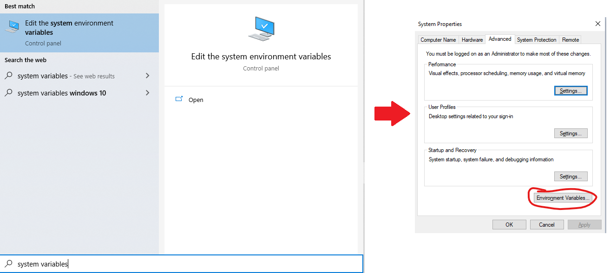
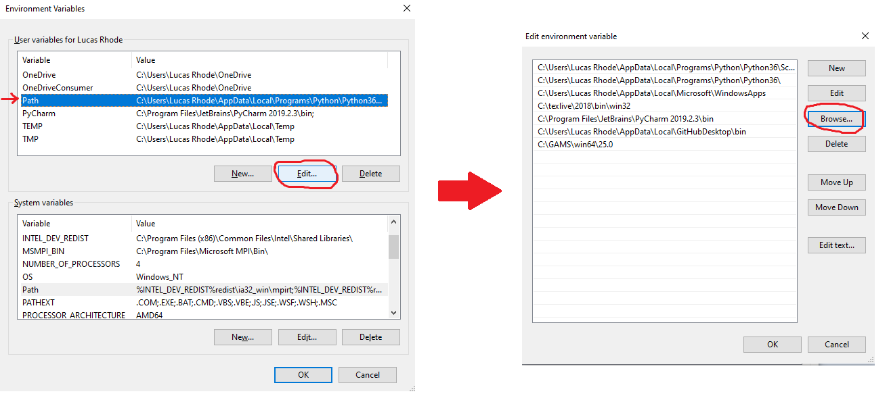
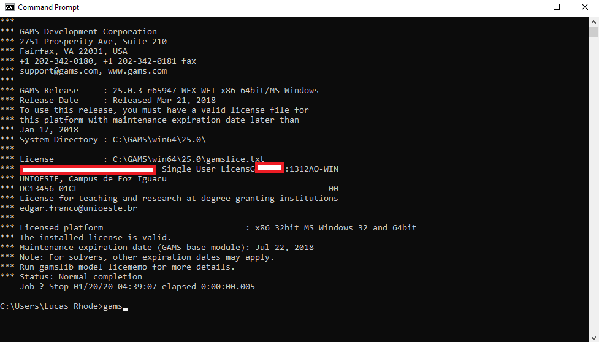

#### GAMS and MATLAB must have the same architecture (x64 ou x32)

# Setting up GAMS

ADAMS expects your machine to have a licensed copy of GAMS and it has to be in your environment variables. That's because ADAMS does NOT implement its own solver, rather, it uses third party software that are much faster and dependable.

#### Adding GAMS to your enviroment variables:

1. Search for "system variables" in Start menu and hit enter

1. After clicking on **Enviroment variables**, select **Path** either from your *User variables* or from your *System variables* and click **Edit**. Now click **Browse** and select the folder where *gams.exe* is located.

1. Test if it worked: open your command line (search for cmd on Start) and type "gams". Your license information should be displayed.

A common error is to forget to activate GAMS with a working license - which is very hard to detect since it doesn't issue any warnings, it just keeps shooting out empty results to ADAMS - so make sure you license is working fine.
