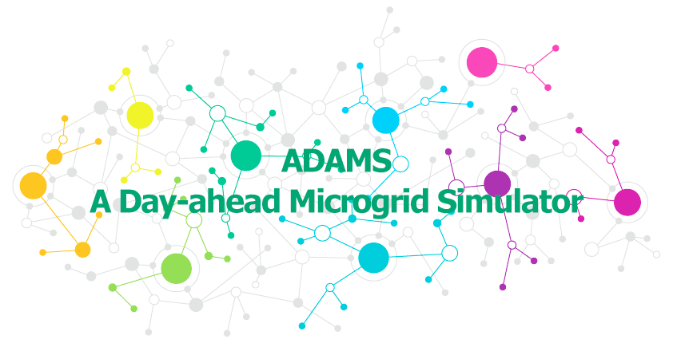
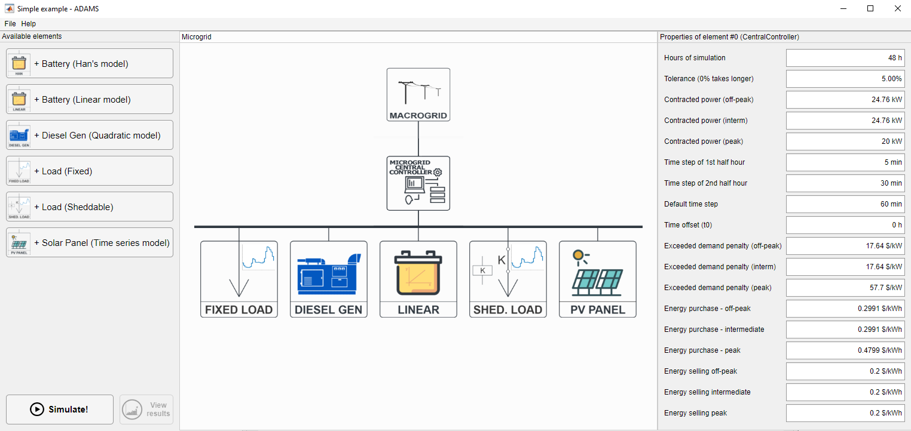
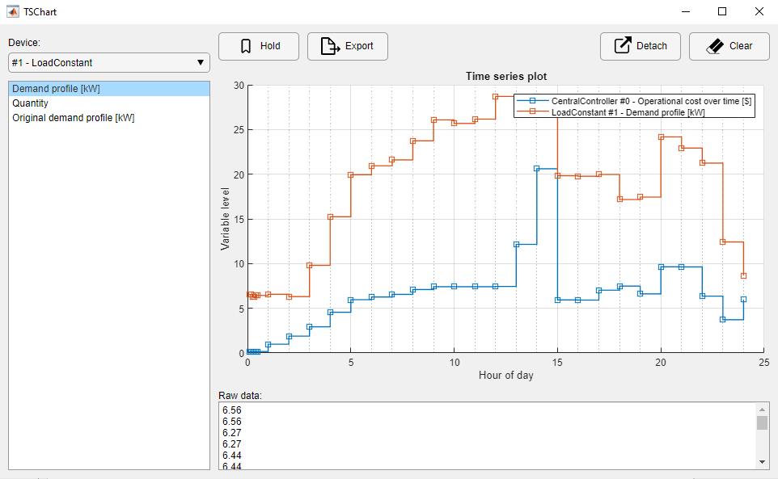

ADAMS is an Windows app built with MATLAB and GAMS that allows the user to create microgrid simulations of a day-ahead planning. It is a result of an undergrad thesis about microgrids presented to the State University of Western Parana (UNIOESTE) on Dec/2019.

# Context
The application consists of a graphical interface meant to configure and run simulations of the optimisation strategy called “day-ahead planning” for microgrids (MGs). In this technique, the main controller of a MG schedules the set-points of all the devices on the MG for, typically, 24-hour horizons. The execution of the day-ahead algorithm means choosing the right combo of generators (and/or batteries) that will deliver the energy needed at the lowest possible cost.

# What does ADAMS do?
ADAMS actually uses a third-party software to solve the optimisation problem: [GAMS](https://www.gams.com/products/introduction/). What ADAMS does is provide an interface so that the end-user doesn't need to worry about mathematical modeling in GAMS (which can be intimidating).

The workflow is as follows:
1. The user sets up the simulation in ADAMS, choosing from a list of available MG elements (diesel generators, solar panels, loads etc.)
1. ADAMS dynamically generates a mathematical model and sends it to GAMS
1. GAMS solves the optimisation problem and sends the results back to ADAMS
1. ADAMS display the results in a nice point-and-click kind of way

# Installation
1. ADAMS expects your machine to have GAMS installed, licensed and in your enviroment path. You can get it [here](GAMS/gams_license.md) or use any version that you already have installed. Check [this](GAMS/README.md) for more information about setting up GAMS.
1. Install using the web installer or the standalone installer: https://drive.google.com/open?id=1OuZuJSZSq1NdYQyCdt4_hXaLGAgDSdeK
1. Done! You can access the user manual [here](USER_MANUAL.pdf) or through the app's Help menu.

# Screenshots
App's main screen:

TSChart: a sub-app to visualize time-series

#### For developers
ADAMS was not meant to have a user interface at first. My idea was to build a framework with which people could easily create small but expressive scripts to simulate microgrid optimization. That's why the infrastructure is divided in three levels:

1. [GAMS communication](pgeec_lib/+gams/GAMSModel.m): very flexible class, the idea is that, if you can write a GAMS model, this class will help you to dinamically load parameters from MATLAB into the model and vice-versa (way better then GAMS-MATLAB original API);

1. [Microgrid modeling](pgeec_lib/+microgrid_model): the heart of everything. This actually creates GAMS code dinamically so that, with few lines, you can have a microgrid up and running, ready for simulations. Each class in this package represents a configurable microgrid element (like a solar panel or a diesel gen), you instantiate new objects and you add them into your microgrid at will;

1. Graphical interface: on top of everything, the GUI organizes calls to item #2 so that it's very very easy to create simulation scenarios.

I intend to publish them separately in the future, each one with their own manual. But documenting and testing everything is very cumbersome as we all know.

Most of the infrastructure is implemented with backward compatibility in mind BUT I was in a hurry and had to use MATLAB's App Designer for the GUI, which means it needs MATLAB R2019a or later to run.
Since we need MATLABs runtime, the app is HUGE (700MB+) - I would've made it using another language but the idea was to make a framework that could easily communicate with Simulink if necessary.

Found any bugs? Feel free to open a new issue, contact me @ rhode.lucasb@gmail.com or to fix it yourself, after all we are on GitHub!
