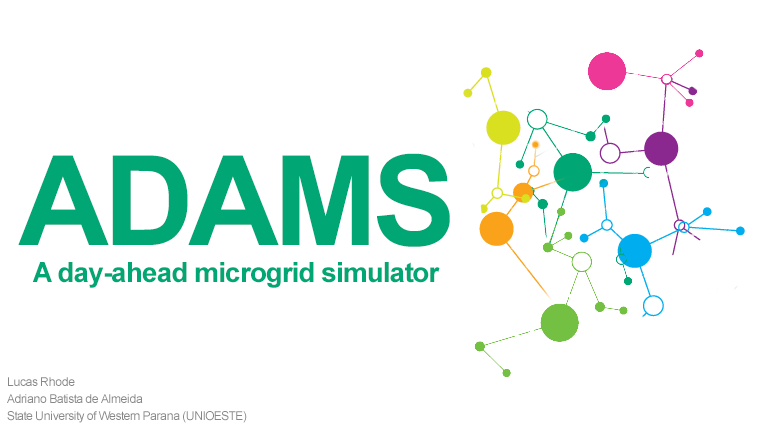

ADAMS is an Windows app built with MATLAB and GAMS that allows the user to create microgrid simulations of a day-ahead planning. It is a result of an undergrad thesis about microgrids presented to the State University of Western Parana (UNIOESTE) on Dec/2019.

# Context
The application consists of a graphical interface meant to configure and run simulations of the optimisation strategy called “day-ahead planning” for microgrids (MGs). In this technique, the main controller of a MG schedules the set-points of all the devices on the MG for, typically, 24-hour horizons. The execution of the day-ahead algorithm means choosing the right combo of generators (and/or batteries) that will deliver the energy needed at the lowest possible cost.

# What does ADAMS do?
ADAMS actually uses a third-party software to solve the optimisation problem: [GAMS](https://www.gams.com/products/introduction/). What ADAMS does is provide an interface so that the end-user doesn't need to worry about mathematical modeling in GAMS (which can be intimidating).

The workflow is as follows:
1. The user sets up the simulation in ADAMS, choosing from a list of available MG elements (diesel generators, solar panels, loads etc.)
1. ADAMS dynamically generates a mathematical model and sends it to GAMS
1. GAMS solves the optimisation problem and sends the results back to ADAMS
1. ADAMS display the results in a nice point-and-click kind of way

# Installation
1. ADAMS expects your machine to have GAMS installed, licensed and in your enviroment path. You can get it [here](GAMS/gams_license.md) or use any version that you already have installed. Check [this](GAMS/README.md) out if you have any trouble setting up GAMS.
1. Install using the web installer or the standalone installer: https://drive.google.com/open?id=1OuZuJSZSq1NdYQyCdt4_hXaLGAgDSdeK
1. Done! You can access the user manual [here](USER_MANUAL.pdf) or through the app's Help menu.

# Screenshots
App's main screen:

TSChart: a sub-app to visualize time-series

Found any bugs? Feel free to open a new issue, contact me @ rhode.lucasb@gmail.com or to fix it yourself, after all we are on GitHub!
